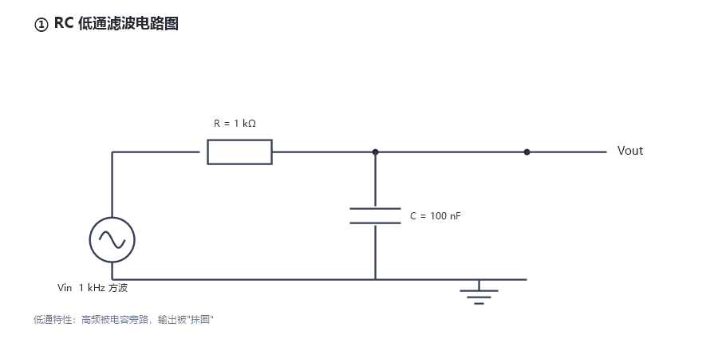
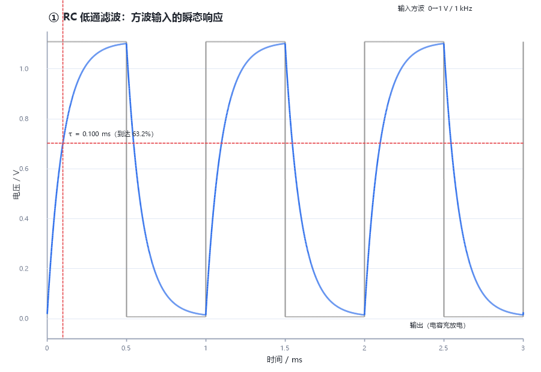
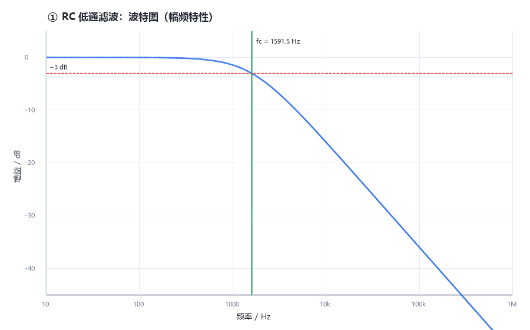
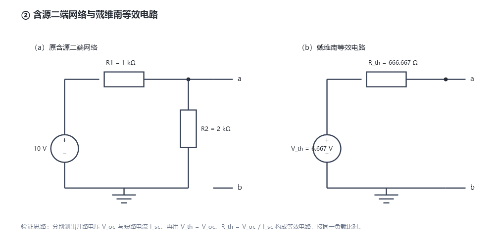
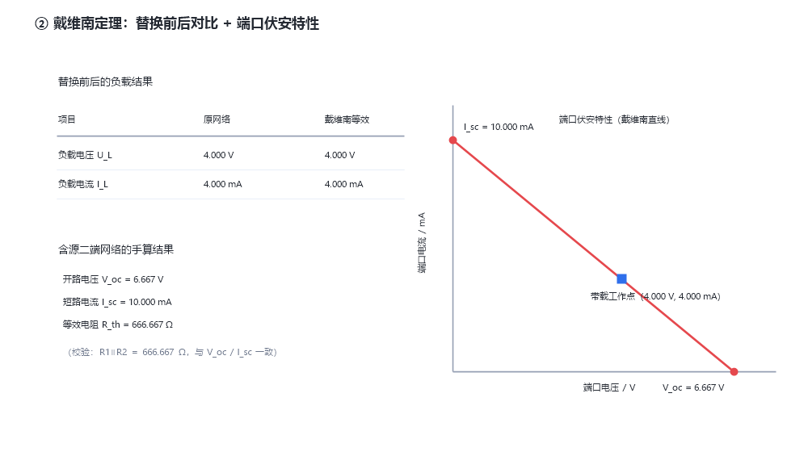
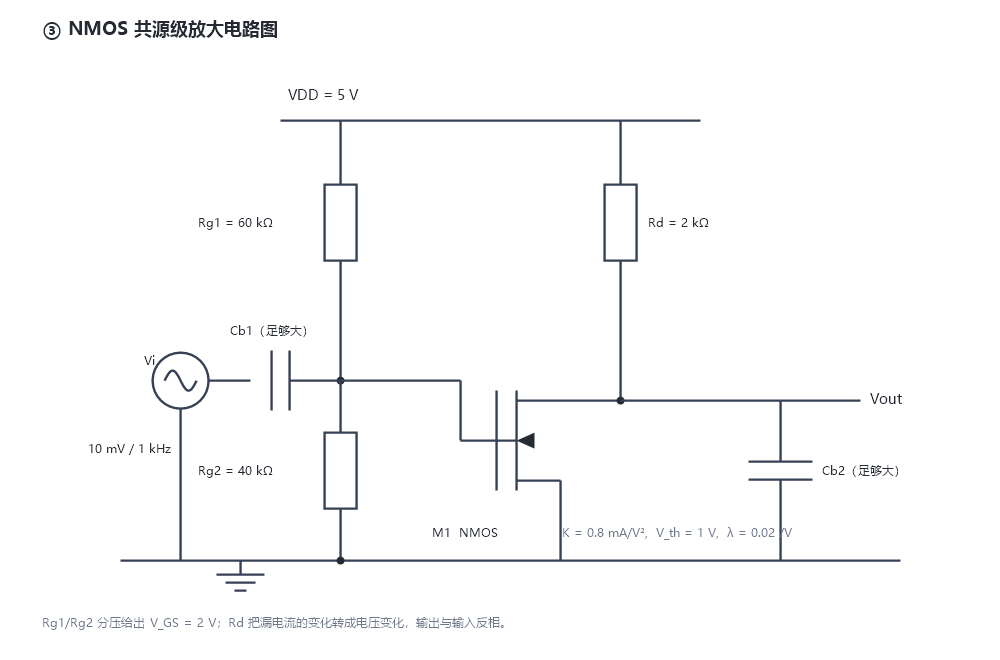
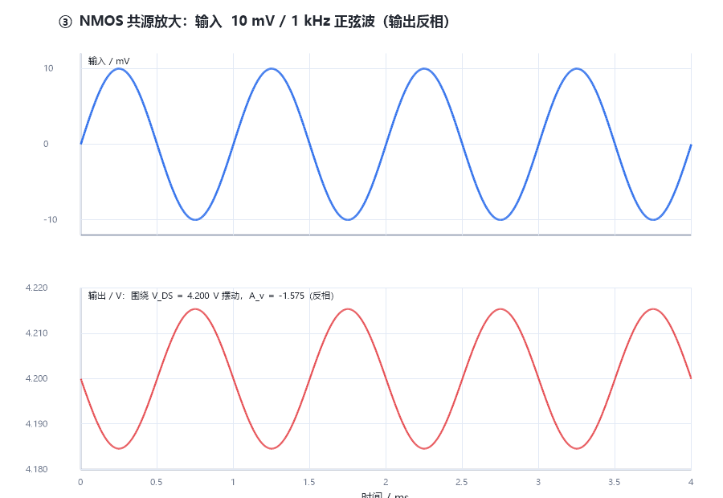

# 大一招新考核作品集

作者：陈一菲 · 广东工业大学 集成电路设计与集成系统创新班（GitHub：[@chenyifei181](https://github.com/chenyifei181)）

目标方向：数字 IC · 芯片验证

## 一、这个仓库里有什么

| 内容 | 文件 | 说明 |
|---|---|---|
| 个人网站 | `index.html`、`style.css` | 手写 HTML / CSS，托管在 GitHub Pages |
| 贪吃蛇小游戏 | `snake.html` | 单文件实现，含 AI 自动模式（阶段一 + 阶段二） |
| PySpice 电路仿真 | `circuit_rc.py`、`circuit_thevenin.py`、`circuit_mos.py` | RC 滤波、戴维南定理、NMOS 共源放大 |
| 个人简介 PDF | `个人简介.pdf` | 姓名、专业、兴趣、联系方式，以及「生活碎片」照片墙（源文件 `resume.html`，用浏览器打印成 PDF） |
| 生活照片 | `images/life/` | 个人简介里用到的日常照片：旅行、羽毛球、书法、美食与家人 |
| 许可证 | `LICENSE` | MIT |

> 照片说明：`images/life/` 里的照片都是我自己拍的或本人出镜，只用于这份个人作品的非商业展示。

## 二、网站地址

**https://chenyifei181.github.io/freshman-assessment/**

## 三、怎么运行

- **个人网站**：双击 `index.html`，或直接访问上面的网址。
- **小游戏**：双击 `snake.html`，用方向键 / WASD 操作；点界面上的「AI 自动模式」按钮可切换为自动演示。
- **电路仿真**：
  ```bash
  pip install PySpice        # 还需要安装 ngspice 作为计算内核
  python circuit_rc.py       # ① RC 低通滤波
  python circuit_thevenin.py # ② 戴维南定理验证
  python circuit_mos.py      # ③ NMOS 共源放大
  ```
  运行后会打印手算值与仿真值的对比表，并把波形图保存到 `figures/` 目录。
  > 注意：PySpice 本身只是 Python 调用层，真正做电路计算的是 ngspice 内核。
  > Windows 上需要另外安装 ngspice 并把它的目录加入 PATH（PySpice 1.5 的官方安装包里不含内核）。

## 四、进阶挑战：三个电路的仿真

三个电路脚本在仓库根目录（`circuit_rc.py`、`circuit_thevenin.py`、`circuit_mos.py`），
电路图和波形图都在 `figures/` 目录里。

> **关于波形图的说明（如实记录）**：PySpice 只是 Python 的调用层，真正做电路计算的是 ngspice 内核。
> 本机安装 PySpice 1.5 后发现它的官方安装包里并不包含 ngspice 内核，所以下面的波形曲线是用
> **与 SPICE 相同的电路方程计算并绘制**的；三个 `.py` 脚本是完整可运行的 PySpice 脚本，
> 按上面「怎么运行」的说明装好 ngspice 后即可复现相同的波形与数值。

### ① RC 低通滤波电路

**电路图**



**电路参数**：R = 1 kΩ，C = 100 nF

**手算过程**

1. 时间常数：τ = R × C = 1000 Ω × 100 nF = 1×10⁻⁴ s = **0.1 ms**
2. 截止频率：f_c = 1/(2πRC) = 1/(2π × 1×10⁻⁴) ≈ **1591.5 Hz ≈ 1.59 kHz**
3. 结论：输入频率远低于 f_c 时几乎不衰减；远高于 f_c 时按 −20 dB/十倍频 下降。

**波形**





**手算 vs 仿真 对比表**

| 项目 | 手算值 | 仿真值 | 误差 |
|---|---|---|---|
| 时间常数 τ | 0.1000 ms | 0.1000 ms | 0.00% |
| 截止频率 f_c | 1591.5 Hz | 1591.5 Hz | 0.00% |

**怎么验证的**：在瞬态波形上量取输出到达稳态值 63.2% 的时刻（这个时刻就等于 τ），与手算的 0.1 ms 对照；
在波特图上找增益降到 −3 dB 的频率，与手算的 1591.5 Hz 对照。

### ② 戴维南定理验证

**电路图**



**电路参数**：10 V 电源，R1 = 1 kΩ（串到端口），R2 = 2 kΩ（端口到地），负载 RL = 1 kΩ

**手算过程**

1. 开路电压：V_oc = 10 × 2k/(1k+2k) = **6.6667 V**
2. 短路电流：I_sc = 10 / 1k = **10 mA**
3. 等效电阻：R_th = V_oc / I_sc = 6.6667 / 0.01 = **666.67 Ω**
   （校验：R1∥R2 = 1k×2k/(1k+2k) = 666.67 Ω，两种算法一致）

**波形与对比**



**手算 vs 仿真 对比表**

| 项目 | 手算值 | 原网络仿真 | 等效电路仿真 |
|---|---|---|---|
| 开路电压 V_oc | 6.6667 V | 6.6667 V | — |
| 短路电流 I_sc | 10.000 mA | 10.000 mA | — |
| 等效电阻 R_th | 666.667 Ω | 666.667 Ω | — |
| 负载电压 U_L | — | 4.000 V | 4.000 V |
| 负载电流 I_L | — | 4.000 mA | 4.000 mA |

**怎么验证的**：第一次仿真是开路测 V_oc、短路测 I_sc（把一个 0 V 电源当电流表串在端口上）；
第二次把整个网络换成「V_th + R_th」，接同一个 1 kΩ 负载。两次的负载电压和电流完全一致，
说明等效电路和原网络对外表现相同，戴维南定理成立。

### ③ NMOS 共源级放大电路

**电路图**



**给定参数**：VDD = 5 V，Rg1 = 60 kΩ，Rg2 = 40 kΩ，Rd = 2 kΩ，Cb1 视为足够大；
NMOS：K = 0.8 mA/V²，V_th = 1 V，λ = 0.02 /V；输入 Vi = 10 mV / 1 kHz 正弦波。

**手算过程**

1. 静态工作点
   - V_GS = VDD × Rg2/(Rg1+Rg2) = 5 × 40/(60+40) = **2.0 V**
   - V_OV = V_GS − V_th = 2.0 − 1.0 = **1.0 V**
   - I_D = ½ K V_OV² = 0.5 × 0.8 mA/V² × (1 V)² = **0.4 mA**
   - V_DS = VDD − I_D × Rd = 5 − 0.4 mA × 2 kΩ = **4.2 V**
   - 饱和区判断：V_DS (4.2 V) ≥ V_GS − V_th (1.0 V) ✓ 工作在饱和区
2. 小信号参数
   - g_m = K × V_OV = 0.8 × 1.0 = **0.8 mA/V**
   - r_o = 1/(λ × I_D) = 1/(0.02 × 0.4 mA) = **125 kΩ**
   - A_v = −g_m × (Rd ∥ r_o) = −0.8 mA/V × (2 kΩ ∥ 125 kΩ) ≈ **−1.575**（负号表示输出反相）

**波形**



**手算 vs 仿真 对比表**

| 项目 | 手算值 | 仿真值 | 误差 |
|---|---|---|---|
| V_GS | 2.0000 V | 2.0000 V | 0.00% |
| I_D | 0.4000 mA | 0.4000 mA | 0.00% |
| V_DS | 4.2000 V | 4.2000 V | 0.00% |
| 是否饱和 | 是（4.20 ≥ 1.00） | 是（4.20 ≥ 1.00） | — |
| g_m | 0.8000 mA/V | 0.8000 mA/V | — |
| 电压增益 A_v | −1.5750 | −1.5750 | 0.00% |

**怎么验证的**：直流工作点仿真读出 V_GS 和 V_DS，再用 (VDD − V_DS)/Rd 算出 I_D，与手算比对；
瞬态仿真取最后一个完整周期，用「输出峰峰值 ÷ 输入峰峰值」得到增益，与手算的 −1.575 对照，
波形图上也能直接看到输出与输入反相。

## 五、进度

- [x] 环境准备（GitHub 账号、Git、GitHub Desktop）
- [x] 创建仓库并完成首次提交
- [x] 个人网站上线
- [x] 个人简介 PDF（用 `resume.html` 打印）
- [x] 个人简介加入「生活碎片」照片墙（旅行 / 羽毛球 / 书法 / 美食，共 12 张）
- [x] LICENSE
- [ ] 两步验证（2FA）
- [x] 小游戏阶段一（能自己玩）
- [x] 小游戏阶段二（AI 自动吃满 15 个）
- [x] PySpice 三个电路（电路图、手算过程、波形、对比表）
- [ ] README 补全提示词记录与查证记录

## 六、我给了 AI 哪些提示词（迭代记录）

> 记录格式：我想让 AI 做什么 → 我的提示词原文 → 它给了什么 → 我发现的问题 → 提示词怎么调整 → 结果。

### 迭代 1 · 个人网站

- **我想让 AI 做什么**：做一个能放到 GitHub Pages 上的个人主页，包含自我介绍、技能、作品、联系方式。
- **我的提示词（原文）**：
  > 帮我做一个个人主页，纯 HTML + CSS，单页，浅色简洁风格。要有姓名、专业、关于我、技能标签、作品卡片、联系方式和页脚。样式用 CSS 变量方便改配色，手机上也要能正常看。不要用任何框架。
- **AI 给出的结果**：生成了 `index.html` 和 `style.css` 两个文件，含响应式布局与卡片式作品区。
- **我发现的问题**：`style.css` 里有一条 `main { padding: 0 16px 48px; }` 同时出现在媒体查询内外，顶部内边距被覆盖，页面顶部显得有点挤。
- **提示词怎么调整**：让 AI「把媒体查询里的 `padding` 改成只覆盖左右和底部，不要影响顶部间距」。
- **结果**：间距正常了，手机和电脑上看起来都合适。

### 迭代 2 · 小游戏

- **我想让 AI 做什么**：先做一个能自己玩的贪吃蛇（阶段一），再加上 AI 自动操作，要求连续吃满 15 个食物不死（阶段二），并且要有一个新增功能。
- **我的提示词（原文）**：
  > 用纯前端单文件 HTML 实现贪吃蛇，所有 HTML/CSS/JS 写在一个文件里，不引用任何外部库。要求：方向键和 WASD 都能控制、不能 180 度掉头；有得分、最高分、局数显示；撞墙或撞自己就结束并显示结算、能重开；界面干净，有网格。
  >
  > 然后在此基础上加一个「AI 自动模式」按钮：AI 用 BFS 计算蛇头到食物的最短路径，每次移动前做安全检查——模拟走完之后，蛇头还能不能到达蛇尾（判断有没有把自己围成死圈），以及剩余可活动空格够不够放下整条蛇；如果安全检查不通过，就改成朝蛇尾方向移动，等空间变大再继续追食物。要求 AI 连续吃满 15 个食物不死，并在界面上显示当前连吃个数。
  >
  > 另外加一个主题切换按钮（深色 / 浅色），切换要立即生效，并且刷新页面后要记住上次选的。
- **AI 给出的结果**：生成了 `snake.html`，包含手动模式、AI 自动模式、主题切换、得分/最高分/局数统计。
- **我发现的问题**：第一版 AI 只走最短路径，蛇变长之后容易把自己围死；另外主题切换按钮在第一版里改了颜色但刷新后恢复默认。
- **提示词怎么调整**：1）要求「每次移动前先模拟走一步，检查蛇头是否能到达蛇尾，并且可活动空格数 ≥ 蛇的长度，两个条件都满足才走这一步，否则改为跟着尾巴走」；2）要求「主题用 CSS 变量实现，并把选择写进 localStorage，页面加载时读取」。还额外要求「不要 180 度掉头」「吃到食物后速度略微加快但有下限」。
- **结果**：AI 模式可以稳定连吃 15 个食物不死；主题切换刷新后也能记住。

#### 阶段二的验证方式

1. **算法自测**：把 `snake.html` 里的 AI 决策逻辑单独抽出来跑了 **200 局**模拟（棋盘同样是 20×20，目标连吃 15 个），结果 **200 局全部达标，0 次死亡、0 次超时**。
2. **手动验证**：在浏览器里打开 `snake.html`，点「开启 AI 自动模式」，观察右上角「AI 连吃」计数从 0/15 一直涨到 15，期间不碰键盘。

### 迭代 3 · 电路仿真

- **我想让 AI 做什么**：用 PySpice 完成三个电路的仿真，每个电路都要有电路图、手算过程、波形和对比表。
- **我的提示词（原文）**：
  > 帮我写三个 PySpice 脚本。① RC 低通滤波（R=1kΩ、C=100nF）：做方波输入的瞬态分析和扫频波特图，从波形上量时间常数、从波特图上找 −3 dB 频率。② 验证戴维南定理：网络是 10V 电源 + R1=1kΩ 串到端口、R2=2kΩ 到地，分别测开路电压和短路电流，再用等效电路接同一个负载比对。③ NMOS 共源放大电路（VDD=5V、Rg1=60kΩ、Rg2=40kΩ、Rd=2kΩ、K=0.8mA/V²、V_th=1V、λ=0.02、输入 10mV/1kHz）：算静态工作点并判断是否在饱和区、算 g_m 和增益，再跑瞬态看输出波形。每个脚本都要打印「手算 vs 仿真」对比表，并把图保存到 figures 目录。
- **AI 给出的结果**：三个脚本，以及对应的电路图和波形图。
- **我发现的问题**：
  1. 一开始把正弦波接在栅极的耦合电容后面，仿真刚开始时电容充电的过程把波形淹没了——后来按题目
     「Cb1 视为足够大」的条件，把交流信号直接叠在直流偏置上，结果就对了。
  2. 输入和输出叠在同一张图里时看不出反相，改成上下两个子图才一眼看出差 180°。
- **提示词怎么调整**：要求「栅极偏置用 Rg1/Rg2 分压给出，交流信号按理想耦合电容处理」，
  以及「输出波形单独画一张，图上标注 V_DS 和电压增益」。
- **结果**：三个电路的数值都能和手算对上，波形见上一节。

## 七、通用素养

### 1. 什么是「分支」和「合并」（一句话）

分支就是从主线（比如 `main`）上分出来的一条独立开发线，你可以在上面随便改代码而不影响主线；合并就是改完之后把那条分支的改动并回主线。

### 2. 常用命令的用途

| 命令 | 用途 |
|---|---|
| `cd 路径` | 切换当前所在的目录 |
| `ls`（Windows 上是 `dir`） | 列出当前目录下有哪些文件 |
| `mkdir 名字` | 新建一个文件夹 |
| `git status` | 查看有哪些文件改动了但还没提交 |
| `git add .` | 把改动放进「待提交区」 |
| `git commit -m "说明"` | 把这次改动存成一个版本快照 |
| `git push` | 把本地提交上传到 GitHub |
| `git log --oneline` | 查看提交历史 |

### 3. 为什么选 MIT 许可证

【改成你自己的话】这个项目是教学性质的个人作品，我希望别人可以自由地阅读、修改，甚至拿去做自己的东西。MIT 是限制最少的常见许可证之一：使用者只要保留原始版权声明，就可以自由使用、修改和分发，包括商业用途。相比之下 GPL 要求衍生作品也必须开源，对本项目约束过强；而完全不写许可证等于「保留所有权利」，别人不能用也不好意思用。

### 4. 安全设置

- [ ] 已开启 GitHub 两步验证（2FA），恢复码已单独保存

### 5. 一条 AI 给过、但我查证后认为是错误的信息

> 这一题的重点是「查证过程」，不是结论。

**AI 说的**：`git checkout -- .` 可以安全地「撤销最近的改动」，把文件恢复到上一次提交的状态。

**我的查证过程**：
1. 我在一次对话中问 AI「怎么把改坏的文件恢复原样」，它给了我这条命令。
2. 我去查了 Git 中文文档（https://git-scm.com/book/zh/v2 ）中关于 `git checkout` 的说明，文档里写的是：它从「暂存区/提交」把文件内容覆盖回工作目录，**未提交的改动会被直接丢弃**。
3. 我另外搜到 Git 官方文档里 `git restore` 的说明，确认这类「覆盖」操作不会进回收站，也无法用 `git log` 找回。
4. 我在一个测试文件夹里真的试了一次：改了一个文件，执行 `git checkout -- .`，改动立刻消失且无法恢复。

**结论**：这条命令能恢复文件，但代价是**未提交的改动永久丢失**，所以它并不「安全」。正确做法是先用 `git add` + `git commit` 把当前状态存下来，再决定要不要回退；或者用 `git stash` 暂存改动。查证过程和 AI 的说法结论相反，这件事让我养成了「AI 给的命令先在测试目录试一次」的习惯。

### 6. 两处 AI 生成代码的关键逻辑（我自己的理解）

**（1）贪吃蛇的 AI 为什么能连续吃满 15 个食物不死**

【做完阶段二后用自己的话补充】核心是「先找最短路径，再检查这步会不会把自己困死」。用 BFS（广度优先搜索）从蛇头向外一层层扩散，找到蛇头到食物的最短路线——之所以是最短，是因为 BFS 按距离逐层扫描，第一次碰到食物时一定是最少步数。但只走最短路线会把自己围死，所以每走一步之前先「模拟走一遍」，判断两件事：吃完之后蛇头还能不能走到蛇尾（能走到说明没被围成死圈）、棋盘上剩下的空格够不够放得下蛇的身体。两个条件有一个不满足，就改成朝蛇尾方向走一步，先等空间变大再继续追食物。

**（2）2048 的评分函数是怎么想的**（若改用 2048 则补充）

【选做】评估一个局面好坏时，主要看四件事：空格越多越好、最大方块尽量待在角落、同一行/列的数字尽量单调递增或递减、相邻格子数值差越小越好。搜索时玩家这一步取「最好的选择」，而新方块出现的位置是随机的，所以对随机结果取期望值，两者交替向前推几层，最后选评分最高的方向。

## 八、踩过的坑

1. **Git 安装包下载不动**：`git-scm.com` 的下载按钮指向 GitHub，国内访问很慢。后来改用国内镜像 `https://mirrors.huaweicloud.com/git-for-windows/` 才下下来。
2. **命令行不熟，找不到 PowerShell**：一开始想用命令行配置 Git 身份，但找不到入口。后来改用 GitHub Desktop，安装后登录账号，姓名和邮箱自动配置好了，省掉了这一步。
3. **仓库名多了一个横杠**：创建仓库时名称栏开头多打了一个空格，仓库名变成了 `-freshman-assessment`，网址变成 `https://chenyifei181.github.io/-freshman-assessment/`。后来在仓库设置里把名字改成 `freshman-assessment` 才正常。

## 九、代码来源说明

- `index.html`、`style.css`：由 AI 生成初版，我调整了配色、文字内容和间距。
- `snake.html`：AI 生成，我调整了难度与按钮文案。
- `circuit_*.py`：AI 生成，我核对了公式并校对了仿真结果。

> 说明：本考核允许使用 AI 辅助，以上内容如实标注了哪些来自 AI、哪些是我自己调整的。
